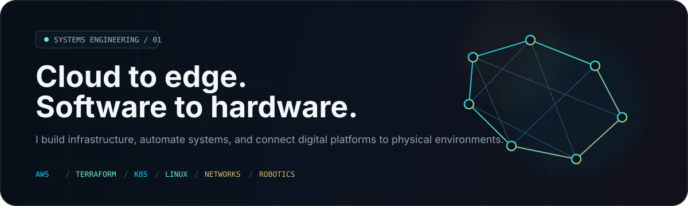
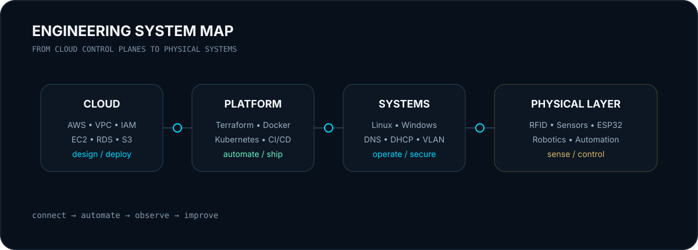

 

---

## 01 / Engineering Profile

I work across the layers that usually get separated into different jobs: **cloud, infrastructure, networks, automation, and physical systems**.

My background includes AWS cloud environments, Linux and Windows infrastructure, Docker/Kubernetes workloads, Terraform, CI/CD, networking, technical lab infrastructure, robotics, IoT, and embedded systems.

What interests me most is the point where those layers meet — when software has to control infrastructure, infrastructure has to support real operations, and hardware has to behave reliably in the physical world.

---

## 02 / Selected Systems

<table>
<tr>
<td width="50%" valign="top">

### ⛽ Smart / Robotic Fueling System

**IoT · Embedded · Automation · Backend / Cloud**

A smart fueling platform built around **RFID-based vehicle identification and authorization**, embedded control, sensing, automated dispensing logic, transaction logging, and software/cloud integration.

This is the project that best represents how I like to work: **software + infrastructure + hardware + a real operational problem**.

`RFID` `Sensors` `Embedded Control` `Automation` `IoT`

</td>
<td width="50%" valign="top">

### 🧰 Infrastructure Home Labs

**Servers · Networking · Virtualization · Self-Hosting**

I use two home-lab environments to go beyond tutorials and work directly with infrastructure: operating systems, services, networking, storage, virtualization, troubleshooting, administration, and system behavior.

The labs are where I test, break, rebuild, and document infrastructure before turning the lessons into cleaner production-style projects.

`Linux` `Windows Server` `Networking` `Virtualization` `Storage`

</td>
</tr>
<tr>
<td width="50%" valign="top">

### ☁️ AWS Infrastructure & Delivery

**AWS · IaC · Containers · CI/CD**

Hands-on work with AWS environments involving **EC2, S3, RDS, VPC, IAM, subnets, security groups, and Linux servers**, alongside containerized workloads, Git/GitHub, CI/CD, Terraform, and monitoring/logging.

`AWS` `Terraform` `Docker` `Kubernetes` `GitHub Actions`

</td>
<td width="50%" valign="top">

### 🤖 Robotics & Physical Computing

**Embedded · Robotics · Sensors · Control**

Built and supported technical systems using **Arduino, ESP32, Raspberry Pi, sensors, drones, robotics, and humanoid platforms**, including programming, integration, troubleshooting, and lab deployment.

`Arduino` `ESP32` `Raspberry Pi` `Python` `C` `Robotics`

</td>
</tr>
</table>

---

## 03 / Stack by Layer

### CLOUD / PLATFORM

### SYSTEMS / NETWORK

### BUILD / AUTOMATE / CONTROL

---

## 04 / What I'm Building Now

> The goal of this account is not to collect tutorial repositories. It is to become a **proof-of-work engineering portfolio**.

### `01` Production-Style AWS Platform
**Terraform → VPC → compute → database → IAM/security → monitoring**

A complete AWS environment documented like a real infrastructure project: architecture, IaC, deployment, operations, tradeoffs, and failure handling.

### `02` Kubernetes Delivery Platform
**Container → CI/CD → Kubernetes → observability**

A deployment platform that demonstrates the full delivery path instead of only a Kubernetes manifest.

### `03` Cloud DevSecOps Pipeline
**IaC scanning → container security → CI/CD controls → cloud security**

A security-focused pipeline built to show how delivery and security can be integrated rather than treated as separate work.

---

## 05 / Credentials

<table>
<tr>
<td width="50%" valign="top">

### Certified

**Google Certified Educator — Level 1**  
**Google Certified Educator — Level 2**  
**REGAL Education — Teaching Methodology Certification**

</td>
<td width="50%" valign="top">

### Previously Certified

**AWS Certified Cloud Practitioner**  
**CompTIA Security+**

Listed as previously certified so the status is clear and accurate.

</td>
</tr>
</table>

---

## 06 / GitHub Signal

 

---

### Cloud → Platform → Systems → Physical World

Build it. Operate it. Understand what happens between the layers.

